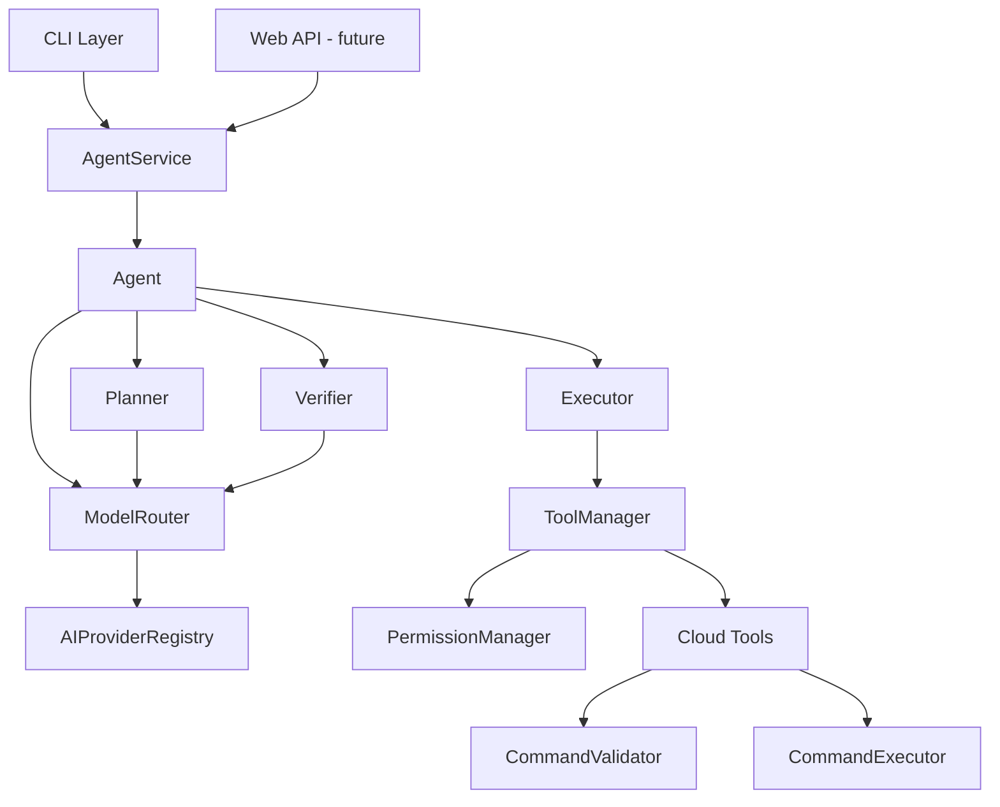

# Architecture

## Design Principles

1. **Provider-agnostic:** AI providers and cloud providers are accessed through interfaces and adapters.
2. **CLI-independent core:** The agent core never imports CLI code. The CLI is a thin interface layer.
3. **Security outside the model:** Permissions, validation, and confirmation are enforced in code, not by prompt instructions.
4. **Incremental complexity:** Each layer builds on the previous without premature abstraction.

## Layer Diagram



## Agent Loop

```
USER REQUEST → INTENT → CONTEXT → PLAN → MODEL → TOOL CALL
→ PERMISSION CHECK → EXECUTION → OBSERVATION → NEXT ACTION → VERIFICATION → RESPONSE
```

## Adding a New AI Provider

1. Create `src/ai/providers/YourProvider.ts` implementing `AIProvider`
2. Create a factory implementing `AIProviderFactory`
3. Register the factory in `createConfiguredAIRegistry()`
4. Add env vars to `.env.example` and provider config in `buildProviderConfig()`

The agent and model router require no changes.

## Adding a New Cloud Tool

1. Create a cloud provider adapter in `src/cloud/<provider>/`
2. Create an `AgentTool` implementation using `CommandExecutor`
3. Register in `AgentService` constructor

The agent core requires no changes.
